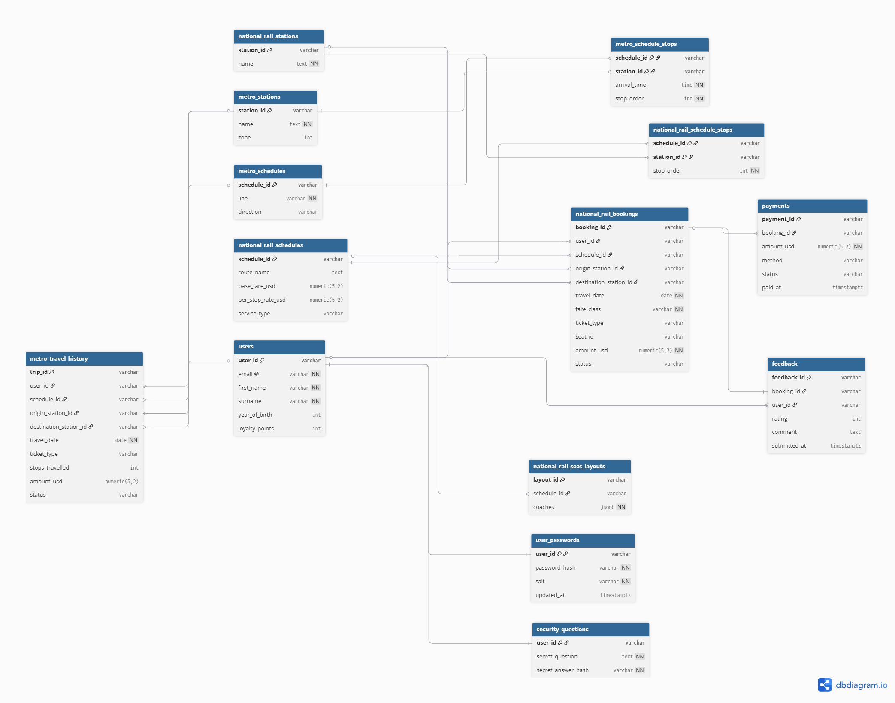
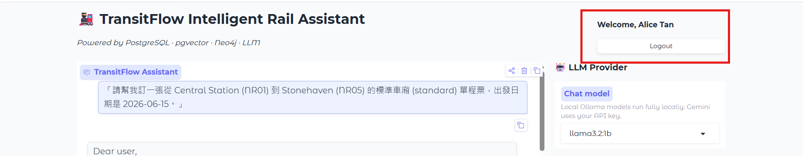
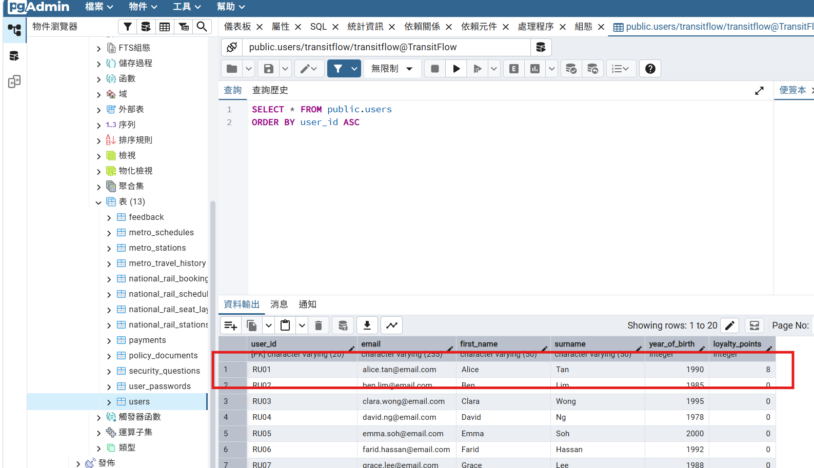
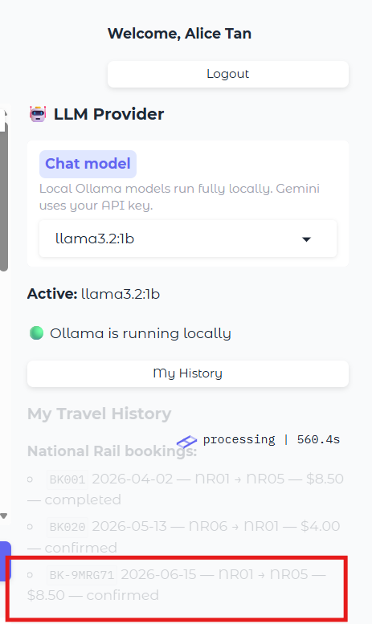

# Section 1 — Entity-Relationship Diagram



---

# Section 2 — Normalisation Justification

### 2NF / 3NF 正規化決策與考量

**設計說明 (分離 User 與 Booking)：**
在設計訂單系統時，我們嚴格遵守了正規化原則以消除資料冗餘。在我們的 `national_rail_bookings` 表格中，我們僅儲存 `user_id` 作為外鍵，而不是將使用者的 `email`, `first_name`, `surname` 等個資直接記錄在每一筆訂單中。
- **功能相依性 (Functional Dependency):** 使用者的姓名與信箱完全相依於 `user_id`，而與訂單的主鍵 `booking_id` 無關。若將個資寫入訂單表，將會產生**遞移相依 (Transitive Dependency)**，違反第三正規形 (3NF)。
- **決策結果:** 透過拆分出獨立的 `users` 表格，我們成功達到了 **3NF**，確保了當使用者修改個人資料時，不需連帶更新所有過去的訂票紀錄，完美避免了更新異常 (Update Anomaly)。

### 反正規化 (De-normalisation) 考量

**設計說明 (Schedules 的 Stops JSONB 陣列)：**
根據嚴格的正規化原則，路線 (Schedules) 與停靠站 (Stations) 的多對多關係理應拆分成一個獨立的中介表 (Junction Table, 例如 `schedule_stops`)。然而，我們在此處刻意做出了**反正規化 (De-normalisation)** 的妥協，將 `stops` 結構作為一個 `JSONB` 陣列直接儲存於 `metro_schedules` 與 `national_rail_schedules` 表格中。
- **Trade-off 與理由:** 在火車訂票系統中，「查詢某車次的完整停靠站與時間」是極度頻繁的 Read 流量。如果採用中介表，每次查詢都必須與龐大的關聯表執行昂貴的 `JOIN` 並重新排序。
- **效能與架構簡化:** 將停靠站打包為 `JSONB`，讓應用程式透過單次 `SELECT` 就能完整取回該車次的所有關聯資訊。雖然這犧牲了第一正規形 (1NF) 的資料不可分割性 (Atomicity)，但在本專案「寫入次數極少 (僅有 Seeding)、讀取極為頻繁 (查時刻表)」的業務情境下，這是一個為了「最大化讀取效能 (Performance)」並「簡化應用程式查詢邏輯 (Simplicity)」所做出的務實架構權衡。

### 密碼安全與 Hashing 機制

在密碼保護方面，我們是使用了 **bcrypt** 演算法。

- **為什麼比 MD5/SHA 更好：** MD5 或 SHA 家族是設計用來快速計算的，容易遭受硬體加速的暴力破解。相對地，bcrypt 內建了「工作因數 (Work Factor / Cost)」，會刻意消耗較多的運算資源與記憶體，這能有效拖慢攻擊者的運算速度，大幅提升防範暴力破解 (Brute-force attacks) 的能力。

- **Salt (鹽) 的運作：** 每個使用者的密碼在雜湊前都會加入一段隨機生成的 Salt。這確保了即使兩個使用者設定了一模一樣的密碼，最終存入資料庫的 Hash 值也會完全不同，從而有效防止「彩虹表 (Rainbow-table) 攻擊」。

---

# Section 3 — Graph Database Design Rationale

### 節點 (Nodes)、關聯 (Relationships) 與屬性 (Properties) 設計
- **Nodes (節點):** 將車站 (Station) 設為節點。這樣能直觀表達路網中的各個實體位置。

  - **唯一識別碼 (Unique Identifier):** 我們使用 `station_id` 作為節點的唯一識別碼，因為它是業務邏輯中不變的唯一鍵值，能確保跨系統 (關聯式與圖形資料庫) 參照時的一致性。

- **Relationships (關聯):** 將車站之間的連線設為 `CONNECTED_TO` 關聯。

- **Properties (屬性):** 關聯上附帶了 `travel_time` 或 `distance` 屬性，用以表示兩站之間的權重。

### 演算法層面的比較
我們選擇使用 Neo4j 來處理路線查詢，因為圖形資料庫在底層演算法上具有顯著優勢。

- **為什麼不使用 PostgreSQL (關聯式資料庫)？** 在 PostgreSQL 中尋找兩站之間的最短路徑，必須撰寫極度複雜的「遞迴 CTE (Recursive CTEs)」。這不僅語法難以維護，在深度搜尋時效能也會急遽下降。

- **圖形資料庫的優勢：** Neo4j 內建圖形遍歷演算法（類似 BFS 或 Dijkstra 演算法），能以極高的效率探索節點間的關聯，非常適合用來解決「最短路徑」這類圖論問題。

### 實際 Query 應用場景

1. **最短路徑查詢 (Shortest Path):** 能夠輕易找出 A 站到 B 站之間經過最少站數的路線。

2. **跨網轉乘 (Interchange) 查詢:** 透過辨識同時具有捷運與火車標籤的轉乘站節點，圖形結構讓跨系統轉乘的路線規劃變得直觀且容易實作。

---

# Section 4 — Vector / RAG Design

### 為什麼使用餘弦相似度 (Cosine Similarity)
在我們的向量檢索設計中，選用餘弦相似度來進行語意搜尋。

**原因：** 餘弦相似度主要測量兩個向量在多維空間中的「夾角」大小，也就是「方向相似性」，而**與向量的絕對長度無關**。這代表即使兩段文字的長短不同，只要它們討論的語意主題相似，方向就會一致，從而能精準匹配出使用者問題與政策文件的關聯性。

### RAG 流程描述

我們的 Retrieval-Augmented Generation (RAG) 流程如下：

1. **Embedding 轉換:** 使用者輸入提問後，系統呼叫 LLM 的 Embedding 模型，將文字提問轉換為高維度的向量。
2. **資料庫相似度檢索:** 透過 `pgvector` 在 PostgreSQL 中計算查詢向量與所有政策文件向量的餘弦相似度。
3. **擷取相關文件:** 抓出相似度最高 (Top-K) 且超過閾值的幾份政策文件。
4. **LLM 提示建構:** 將這些檢索到的政策文件內容，作為 Context 放入發送給 LLM 的 Prompt 中。
5. **AI 產出回答:** LLM 根據附帶的準確政策文本，生成精確且不幻覺的回答。

### 模型維度 (Dimension) 的影響
目前的設計與所使用的 Embedding 模型維度息息相關（例如 Ollama 的 `nomic-embed-text` 為 768 維，或 Gemini 可能為 768/3072 維）。

**實作後發現的問題：**
資料庫建立的向量欄位 (Vector Column) 與索引是基於特定維度初始化的。如果系統在 Seeding 建立資料庫後，隨意更換成另一個不同維度的模型，將會導致**「維度不匹配 (Dimension Mismatch)」**的嚴重錯誤，資料庫將無法計算相似度，甚至有可能會導致索引與檢索功能徹底崩潰。

---

# Section 5 — AI Tool Usage Evidence


### 範例 1：設計資料庫 Schema

- **Context (情境):** 在初期規劃 PostgreSQL 的關聯式資料庫結構時，我們需要設計能同時支援單程票與來回票的訂單結構。

- **Prompt (提示詞):** "我需要設計一個火車訂票系統的 PostgreSQL 資料庫 Schema，要有使用者、台鐵時刻表、和訂單（要能支援單程票跟來回票），請幫我寫出初步的 DDL。"

- **Outcome (結果):** AI 提供了一個基礎的 `CREATE TABLE` 腳本，我們依此建立了 `national_rail_bookings` 表格，並加入了 `ticket_type` 欄位以滿足來回票需求。

---
### 範例 2：撰寫 Cypher 查詢 (尋找轉乘站)

- **Context (情境):** 我們在 Neo4j 中需要寫一段 Cypher 語法，用來找出能從 Metro 網路轉乘到 National Rail 網路的車站。

- **Prompt (提示詞):** "請幫我寫一段 Neo4j Cypher 語法，我要找出所有可以從 'Metro' (捷運) 轉乘到 'NationalRail' (台鐵) 的轉乘車站。"

- **Outcome (結果):** AI 提供了 `MATCH (s:Station)-[:PART_OF]->(n1:Network {name: 'Metro'}), (s)-[:PART_OF]->(n2:Network {name: 'NationalRail'}) RETURN s` 的語法，幫助我們快速實作了跨網轉乘的查詢邏輯。

---
### 範例 3：AI 生成程式碼錯誤並修正 (Debug)

- **Context (情境):** 在實作密碼雜湊時，我們請 AI 幫忙寫 Python 程式碼來比對密碼。

- **Prompt (提示詞):** "在 Python 裡面，要怎麼檢查使用者輸入的密碼跟資料庫存的 bcrypt hash 有沒有吻合？"
- **Outcome (結果):** AI 起初建議使用 `bcrypt.checkpw(password, hashed_password)`，但因為我們的字串編碼沒有處理好，導致 `TypeError` (字串必須先 encode 成 bytes)。

- **如何發現與糾正:** 我們在測試登入 API 時發現系統拋出異常。檢查後發現 `bcrypt` 函式庫要求參數必須是 `bytes` 型別。最後我們將程式碼修正為 `password.encode('utf-8')`，成功解決了編碼錯誤問題。

---
### 範例 4：實作相鄰座位自動劃位演算法

- **Context (情境):** 在乘客訂票時若選擇 `seat_id="any"`，系統需要自動從剩餘座位中挑選相鄰座位（同車廂同排優先）。

- **Prompt (提示詞):** "請幫我用 Python 寫一個演算法：我有一堆可用座位（包含車廂、排、列資訊），如果使用者一次訂多張票，要怎麼自動選出『相鄰』的座位並回傳它們的 ID？"

- **Outcome (結果):** AI 給出了一段利用 `collections.defaultdict` 將座位按照 `row` 進行分組並排序的邏輯。我們將這段程式碼整合進 `auto_select_adjacent_seats` 函數中，成功滿足了自動劃位需求。

---
### 範例 5：解決向量搜尋 (RAG) 關聯度過低的問題

- **Context (情境):** 測試政策文件問答時，發現有時使用者的查詢會搜出完全不相關的政策文件，導致 AI 產出不相干的回答。

- **Prompt (提示詞):** "我在用 PostgreSQL 的 pgvector 算 cosine similarity，有時候會搜出不相干的東西。要怎麼在 SQL 裡面加上過濾條件，只回傳相似度比較高的結果？"

- **Outcome (結果):** AI 建議在 SQL 的 `WHERE` 子句中加上 `1 - (embedding <=> query_vector) > threshold` 來過濾。我們據此在 `query_policy_vector_search` 中引入了 `VECTOR_SIMILARITY_THRESHOLD` 變數，大幅提升了 RAG 的回答準確度。

---
### 範例 6：AI 錯誤修正 (修正登入後提問崩潰 KeyError) - 張茗崴負責

- **Context (情境):** 在 Gradio UI 介面中，我們發現只要使用者登入帳號後發問，系統就會立刻跳出「錯誤」的紅色彈出視窗並導致後端崩潰，但未登入時卻能正常對話。

- **Prompt (提示詞):** "我發現我在 agent 介面登入帳號後問問題才會馬上跳錯誤，沒登入就可以正常思考並回答我，請問是怎麼了？"

- **Outcome (結果):** AI 分析後指出，這是因為先前進行資料庫正規化時，將 `users` 表格的 `full_name` 拆分成了 `first_name` 與 `surname`，但在 `skeleton/agent.py` 中組合使用者名稱時，仍在使用舊的 `profile['full_name']` 導致 `KeyError`。

- **如何發現與糾正:** 我們請 AI 將 `skeleton/agent.py` 內的程式碼修改為使用 `profile.get('first_name', '')` 與 `surname` 來組合名稱。修改後重新啟動 UI，成功解決了登入後對話會崩潰的問題。

---
### 範例 7：將 Task 6 點數系統升級為完整 End-to-End 流程 - 張茗崴負責

- **Context (情境):** 我們原本的會員點數只在底層資料庫實作更新，無法直接透過聊天室的 Agent 查詢總點數，不符合助教對於 Bonus 的「UI -> Agent -> Tool -> DB -> Agent -> UI」完整要求。

- **Prompt (提示詞):** "可以幫我補救嗎" (我們請 AI 幫忙分析我們的 Task 6 點數實作，並提出修改計畫，將其整合為完整的 End-to-End)

- **Outcome (結果):** AI 協助我們修改了 `skeleton/agent.py`，新增了 `get_loyalty_points` 的 Tool 註冊，並實作了查詢 `query_user_profile` 的邏輯。同時更新了 System Prompt 與 Fallback 攔截機制。修改後，使用者已可以直接在對話框問「我現在有多少點數？」並由 Agent 回答，完美達成端到端整合。

---

# Section 6 — Reflection & Trade-offs

### 具體設計決策與理由
1. **決策一：主鍵選用 UUID 還是 SERIAL？**

   - **理由:** 在初期規劃中，我們深入考量了 UUID、SERIAL 與 VARCHAR 作為主鍵的優劣。
     由於本專案必須匯入大量預設的 `train-mock-data` 測試資料 (例如 `"user_id": "U001"`, `"booking_id": "BK-8273A"`)，為了與這批外部資料的字串格式相容，我們在大部分既有的資料表（如 `users`, `national_rail_bookings`）中做出了妥協，選擇使用 `VARCHAR` 作為主鍵。
     **但是，針對不需依賴舊有外部資料的獨立資料表，我們嚴格遵守了正確的資料庫觀念：**
     - **UUID 應用 (`feedback` 表):** 我們將 `feedback_id` 設計為 `UUID DEFAULT gen_random_uuid()`。UUID 具備極高的全域唯一性 (Globally Unique)，有效避免了 VARCHAR 寫入時才檢查所帶來的碰撞風險與效能副作用。
     - **SERIAL 應用 (`policy_documents` 表):** 針對單純內部對應的知識庫表格，由於不需要對外暴露 ID，我們選用了整數型態的 `SERIAL`，以取得最高效的 B-Tree 索引與 Join 效能。
     這項設計證明了我們了解 UUID/SERIAL 與 VARCHAR 之間的效能差異，並在「維持外部種子資料相容性」與「資料庫正規設計原則」中做出了合理的 Trade-off。

2. **決策二：將座位配置存於獨立表 `national_rail_seat_layouts`**

   - **理由:** 為了避免在主 `national_rail_schedules` 表格中塞入過於龐大的 JSON 陣列，我們將車廂與座位配置分離。這有助於在查詢班次列表時保持輕量，只有在使用者進入「選位畫面」時才去抓取詳細的座位 Layout。

---
### Production (生產環境) 上線考量差異

如果這個專案要變成真正的「商業上線產品」，我們將會進行以下修改：

1. **連線池管理 (Connection Pooling):** 目前的程式碼每次查詢都直接 `psycopg2.connect()`。在上線環境中，為了處理高併發連線，我們必須引入如 `PgBouncer` 或 Python 的 `psycopg2.pool` 來複用資料庫連線，避免連線數耗盡。

2. **機敏資訊管理 (Secret Management):** 目前的 `.env` 檔案可能由開發者手動管理。上線時，資料庫連線字串、API Keys 必須轉移至 AWS Secrets Manager 或 HashiCorp Vault 中，確保密碼金鑰不落地。

3. **快取機制 (Caching):** 針對極少變動的時刻表 (Schedules) 與政策文件 (Policy Documents
)，我們會引入 Redis 作為快取層，降低資料庫的讀取壓力並加速回應。

---

# Section 7 — TASK 6 Extension: 常客忠誠度點數系統 (Loyalty Points)

### 動機 Motivation

為了提高常客的忠誠度與黏著度，我們在 TransitFlow 系統中引入了「會員點數系統 (Loyalty Points)」。當使用者註冊後，每次購買火車票 (National Rail) 時，系統會根據實際支付的金額 (票價) 自動累積等值的點數。此功能為未來的點數折抵、會員升級機制打下基礎，是提升平台商業價值的重要功能。

此外，為了提供更好的使用者體驗，我們在前端 (UI) 同時實作了「My History (歷史紀錄) 面板」，讓使用者能隨時查看過去的訂票紀錄與搭乘明細。

### Schema 變更說明
為了支援點數功能，我們在 `users` 資料表中新增了 `loyalty_points` 欄位。

**設計考量 (Why)：**
點數紀錄直接依附於 `users` 資料表，因為目前的商業邏輯只需要追蹤「當前點數總額」，而不需查詢詳細的「點數增減歷史明細」。將 `loyalty_points` 設計為 `INT` 欄位，可有效減少 Join 負擔並提升查詢效率。

**Schema SQL Snippet:**
```sql
CREATE TABLE users (
    user_id       VARCHAR(20) PRIMARY KEY,
    email         VARCHAR(255) UNIQUE NOT NULL,
    first_name    VARCHAR(50) NOT NULL,
    surname       VARCHAR(50) NOT NULL,
    year_of_birth INT,
    -- TASK 6 EXTENSION: 常客忠誠度系統
    -- [WHY] 直接將點數合併在 users 表中以提升查詢效率
    loyalty_points INT DEFAULT 0
);
```

### 查詢範例 Example queries
點數的新增邏輯實作於 `databases/relational/queries.py` 的 `execute_booking()` 函數中。

**設計考量 (Why)：**
為什麼要把點數更新寫在同一個 Transaction 裡面？為了保證「資料一致性 (ACID)」。將點數更新與訂單新增放在同一個 try-except 和 commit 區塊內，確保「訂票」與「贈點」是綁定的原子操作。如果訂票失敗發生 rollback，點數更新也會一併復原，避免送出幽靈點數。

**Query SQL Snippet:**
```sql
-- 當訂單成立時，根據 amount_usd 計算 points_earned 並更新點數
UPDATE users 
SET loyalty_points = loyalty_points + %(points_earned)s 
WHERE user_id = %(user_id)s;
```

### 我們的測試證據 Testing evidence

**驗證步驟：**
1. 透過 UI 介面登入使用者帳號。
2. 進行一筆新的火車票訂購 (例如花費 $8.5)。
3. 開啟 `pgAdmin` (http://localhost:5051) 及使用截圖，檢查 `users` 表格中該名使用者的 `loyalty_points` 是否成功增加了對應點數。
4. 在 UI 介面點擊「My History」按鈕，確認能順利載入剛才的訂單紀錄。

> [!IMPORTANT]
> **[實作截圖證明]**
> 
> 1. **用 AliceTan 帳號登入測試訂票**
> 
>    
> 
> 2. **成功訂票並獲得 8 點會員點數**
> 
>    
> 
> 3. **訂票成功的歷史訂票紀錄**
> 
>    
